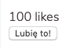

### Zadanie 1 - `js/task01.js`

Stwórzcie komponent o nazwie `LikeBox`.

Powinien on składać się z licznika polubień oraz przycisku do kliknięcia, że użytkownikowi podoba się dana treść.

Póki co, komponent ten ma nic więcej nie robić. Wyrenderujcie go na stronie. Zadanie wykonajcie w oparciu o **komponent funkcyjny**.

Przykładowy wynik:

