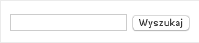

### Zadanie 0a - `js/task0a.js`

Stwórzcie komponent wyszukiwarki. Powinien on posiadać jedno pole tekstowe `input` i obok `button` "Wyszukaj".

Póki co, komponent ten ma nic więcej nie robić. Wyrenderujcie go na stronie.

Zadanie wykonajcie w dwóch wersjach:

- Najpierw z komponentem w wersji funkcyjnej 
- Oraz z tym samym komponentem w wersji zbudowanej z klasy ES6

Przykładowy wynik:

