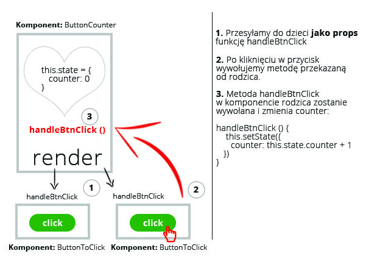

### Zadanie 0a - `js/task0a.js`
Stwórzcie komponent `ButtonCounter` oraz komponent `ButtonToClick`.

Komponent `ButtonCounter` wyświetla `div`, a w nim `h1` oraz 2 przyciski stworzone za pomocą komponentu `ButtonToClick`. W `h1` ma być na początku wyświetlane 0 - docelowo ma tam się wyświetlać ile razy (łącznie) zostały kliknięte przyciski.

Komponent `ButtonToClick` zawiera przycisk `button`, po kliknięciu którego jest przesyłana odpowiednia informacja do callbacku, który pobiera z props atrybut pod nazwą `onClick`. Nie zapomnij sprawdzić czy ten atrybut został odpowiednio przekazany i jest funkcją.

Na schemacie niżej zostało zobrazowane jak mniej więcej powinien wyglądać proces przkazywania funkcji i gdzie ona jest wywoływana. To tylko rysunek poglądowy, pomagający zrozumieć cały proces.

Pamiętajcie, aby zbudować jeszcze główny komponent `App`, a w nim wykorzystywać komponenty budowane w ćwiczeniach. Renderujcie na stronie główny komponent `App`.